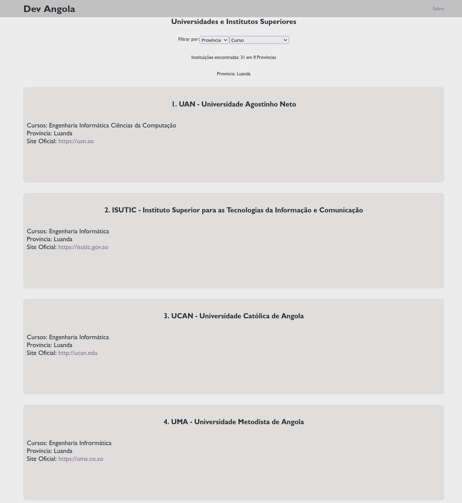

# dev-angola
## Preview

## Abrir a pagina
[Abrir a página](https://kamuango-elton.github.io/dev-angola/)
## Conteúdo

- [Dev Angola](#dev-angola)
	- [Conteúdo](#conteúdo)
	- [Introdução](#introdução)
	- [Universidades e Institutos Superiores](#universidades-e-institutos-superiores)
	- [Centros de Formação Profissional](#centros-de-formação-profissional)
		- [Luanda](#luanda-1)

## Introdução
Está em Angola e deseja saber onde se especializar como `dev`? Está num bom lugar.
Aqui são listadas Instituições de Ensino Superior e Centros de Formação Profissional em Angola para te ajudar a alcançar os seus objectivos.

Sinta-se livre para contribuir com o projecto. Veja aqui [Como contribuir](contribuindo.md).
## Universidades e Institutos Superiores
Veja as Universidades e Institutos Superiores aqui na [Lista das Universidades e Institutos Superiores](https://kamuango-elton.github.io/dev-angola/)

## Centros de Formação Profissional
Alguns Centros de Formação para se profissionalizar como Dev em Angola:
### Luanda
- [CFITEL](https://www.itel.gov.ao/) - Centro De Formação Tecnológico do ITEL
- [Buka](https://bukaapp.com) - Buka
- [CINFOTEC](https://cinfotec.gov.ao) - Centro Integrado de Formação Tecnológica

## Criador ✨

      <a href="https://github.com/kamuango-elton">
        
         
	
Elton Kamuango

      </a>

 

## Contribuidores

### Licença
> Este projeto está licenciado nos termos da licença MIT.
